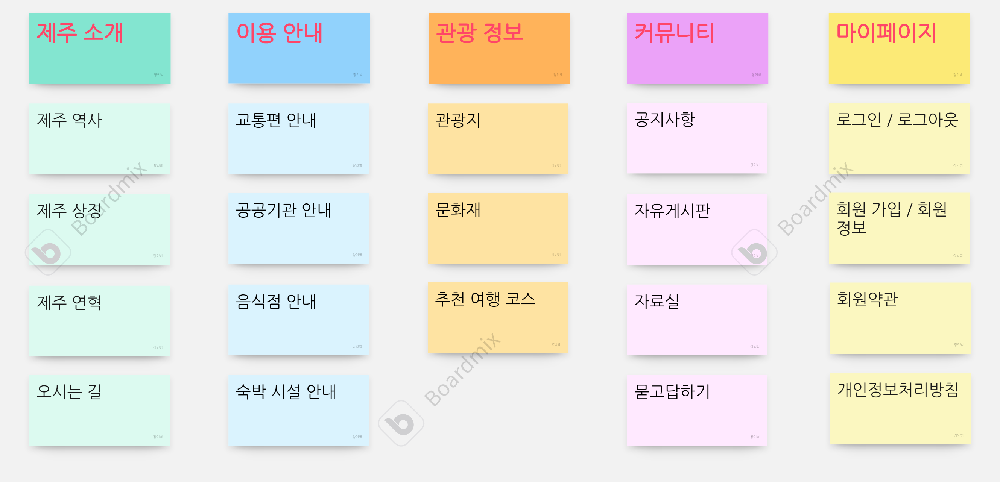
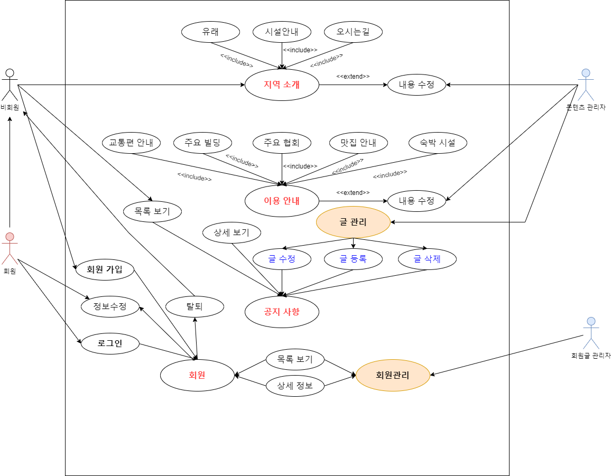
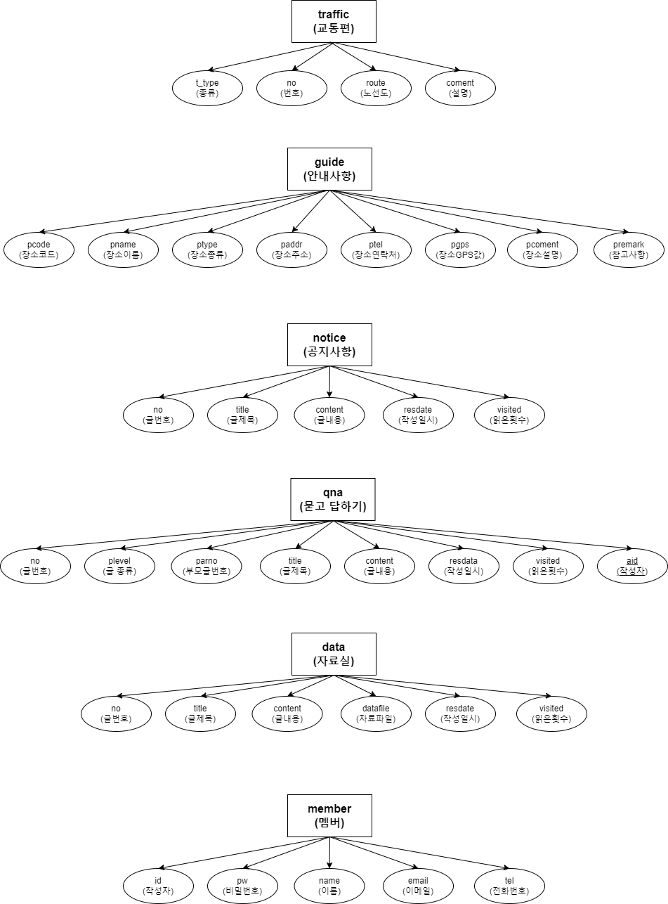
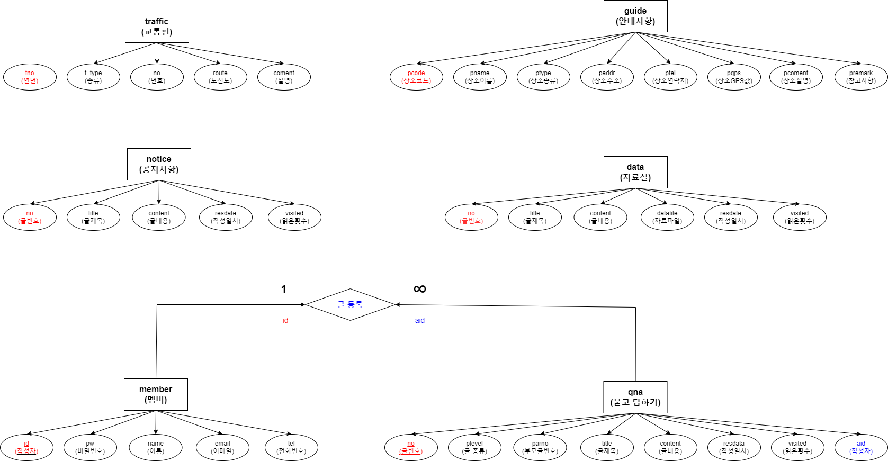
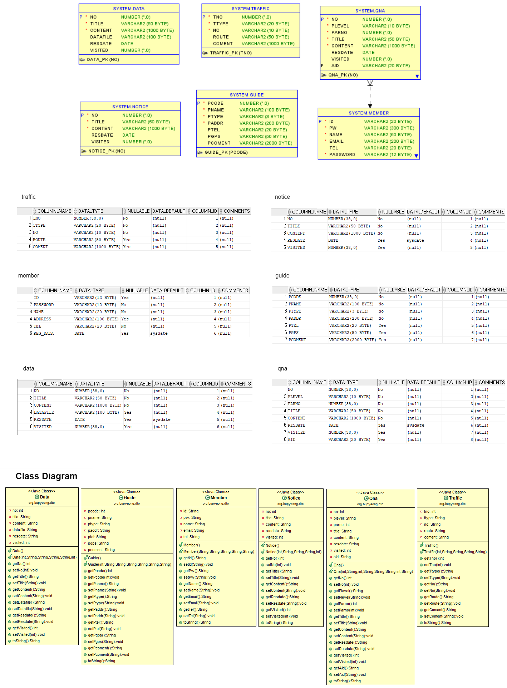

# 프로젝트 개발 보고서(Project Development Report)

## 1. 프로젝트 개요(Project Outline)
    제주도에 관련된 다양한 정보를 제공하고 사용자들에게 제주도 여행을 계획하고 정보를 얻을 수 있는 웹 애플리케이션을 자바 기반의 웹 애플리케이션으로 개발하게 되었다.

    A web application that provides various information related to Jeju Island and allows users to plan and obtain information about Jeju Island has been developed as a Java-based web application.

   

## 2. 프로젝트 목적(Project Purpose)
    가산동의 유래와 동네의 특징, 그리고, 곳곳에 산재되어 있는 각 종 기관과 
    가산동에 위치한 가산디지털단지의 빌딩, 맛집 등을 소개하고, 가산동의 소식을 전달하며,
    커뮤니티를 이루고, 정보를 공유할 목적으로 개발하게 되었다.

    The origins of Gasan-dong, the characteristics of the neighborhood, and various institutions and institutions scattered throughout the area.
    Introducing the buildings and restaurants of the Gasan Digital Complex located in Gasan-dong and delivering news about Gasan-dong.
    It was developed for the purpose of forming a community and sharing information.

   

## 3. 프로젝트 개발 환경 정보(Project Development Environment)
    - Project Topic : Jejudo Intro Web Application
    - Develope Environment : Open JDK 11
    - Language : Java 11
    - Web Module : Jsp/Servlet 3.0
    - Process Pattern : MVC Pattern
    - Database System(DBMS) : MySQL 8.0.36
    - Database Design : MySQL Workbench 8.0 CE
    - Entity Relationship Design : draw.io 20.8.16
    - Java Database Connector : ojdbc11
    - Application Design : Object aid 1.2.4
    - Back Template Language : Java/Servlet 11
    - Front Template Language : Jsp(JSTL/EL) 3.0/HTML5/CSS3/Javascript ES5
    - Web (Application) Server : Tomcat 9.0
    - Navigation Design : WordCloud 3.7, Card Sort BoardMix

   

## 4. 프로젝트 기획 및 설계(Project Planning & Design)

### 4-1. 네비게이션 설계(Nevigation Design)

| 제주 소개 | 이용안내 | 관광정보 | 커뮤니티 | 마이페이지 |
|----------|----------|----------|----------|----------|
| 제주 역사 | 교통편 안내 | 관광지 | 공지사항 | 로그인 / 로그아웃 |
| 제주 상징 | 공공기관 안내 | 문화재 | 자유게시판 | 회원가입 / 회원정보 |
| 제주 연혁 | 음식점 안내 | 추천 여행 코스	| 자료실 | 회원약관 |
| 오시는 길 | 숙박시설 안내 | &nbsp | 묻고 답하기 | 개인정보처리 방침 |

 

### 4-1-1. 자료 수집

 

### 4-1-2. 컨텐츠 분류

 

### 4-1-3. 서비스 흐름 설계

 

### 4-1-4. 서비스 시나리오(Service User Scenario)
* **회원/비회원 사용자 시나리오(Member User Scenario)**

	1) 지역 소개인 제주 역사와 상징 및 연혁을 탐색한다.
	2) 해당 지역의 지도가 궁금하여 오시는 길을 탐색한다.
	3) 해당 지역의 교통편을 알아보고, 방문을 계획한다.
	4) 사용자는 어디 어디에 방문할 지 공공기관과 음식점, 숙박시설 등을 확인한다.
	5) 사용자는 제주도의 관광지, 문화재, 추천 여행코스에 대한 정보를 확인한다.
	6) 해당 지역의 이벤트나 특이사항을 확인하기 위하여 공지사항의 글을 확인한다.
	7) 공지사항의 글을 확인하거나 질문을 위하여 회원가입을 시작한다.
	8) 회원가입을 시작하게 되면, 회원 약관 및 개인정보처리 방침에 동의하도록 한다.
	9)  회원가입 페이지에서 필수 정보를 입력하고, 아이디의 중복확인 거쳐 회원가입을 완료하도록 한다.
	10) 회원 가입 후 로그인을 하도록 한다.
	11) 공지사항 글을 확인하고, 해당 정보가 없는 경우 궁금한 사항을 질문하기 위해 묻고 답하기로 이동한다.
	12) 묻고 답하기 페이지에서 궁금한 사항에 대한 답이 있는지 검색한다.
	13) 해당 정보가 있으면, 해당 묻고 답하기 글을 확인하고, 없으면 질문을 등록하도록 한다.
	14) 자유게시판에서 페이지 이용 유저들 끼리 서로 필요한 정보를 교환할 수 있도록 한다.
	15) 자유게시판은 모든 유저가 글을 등록할 수 있고, 수정 및 삭제는 글 작성자만 가능하도록 한다.
	16) 자유게시판의 글에 댓글을 등록할 수 있고, 등록한 댓글의 삭제는 댓글 등록자만 가능하도록 한다.
	17) 카탈로그나 가이드가 있는지 확인하기 위해 자료실을 탐색한다.
	18) 해당 자료가 있음을 확인하고, 자료를 다운로드 한다.
	19) 마이페이지에서 로그인된 상태라면, 회원가입 정보를 확인할 수 있고 정보를 수정할 수 있도록 한다.

* **관리자 시나리오(Administrator Scenario)**
	1) 관리자로 로그인을 하도록 한다.
	2) 공지사항 목록을 확인하고, 누락된 상세정보가 있는지 확인한다.
	3) 해당 지역의 이벤트나 특이사항을 공지사항으로 등록하도록 한다.
	4) 변동된 내용이 있을 경우 공지사항을 수정하도록 한다.
	5) 이벤트나 특이사항 중에서 취소된 내용이 있어 공지사항 글을 삭제하도록 한다.
	6) 묻고 답하기 목록으로 이동하여, 등록된 질문을 확인하여 답변 글을 등록한다.
	7) 만약, 스팸 글인 경우나 불필요한 질문이 있는 경우 해당 글을 삭제하도록 한다.
	8) 카다로그나 가이드가 새롭게 발생한 경우 자료실에 해당 글을 쓰고, 자료를 등록하도록 한다.
	9) 지역 소개에 대한 변동이 있어 해당 페이지의 내용을 수정한다.
	10) 이용안내에 대한 변동사항이 있어 새로운 내용으로 변경한다.
	11) 회원목록으로 이동하여 신규 회원이나 탈퇴 회원을 확인하도록 하고, 
	현재 제적 사유에 해당하는 회원은 회원탈퇴 시키도록 한다.

### 4-2. 데이터베이스 설계

#### 4-2-1. 개념적 설계

 

#### 4-2-2. 논리적 설계

 

#### 4-2-3. 물리적 설계

 